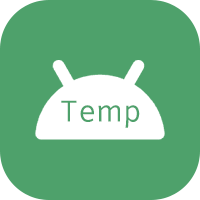

# android-app-template

[](https://github.com/BetterAndroid/android-app-template/blob/main/LICENSE)
[](https://t.me/BetterAndroid)
[](https://t.me/HighCapable_Dev)
[](https://qm.qq.com/cgi-bin/qm/qr?k=Pnsc5RY6N2mBKFjOLPiYldbAbprAU3V7&jump_from=webapi&authKey=X5EsOVzLXt1dRunge8ryTxDRrh9/IiW1Pua75eDLh9RE3KXE+bwXIYF5cWri/9lf)



A template for quickly creating basic Android project.

English | [简体中文](README-zh-CN.md)

|  | [BetterAndroid](https://github.com/BetterAndroid) |
| ------------------------------------------------------------------------------------------------------------------------------- | ------------------------------------------------- |

This project belongs to the above-mentioned organization, **click the link above to follow this organization** and discover more good projects.

## What's this

This is a template for quickly creating a basic Android project.

Through this template, you can quickly create a clean and concise standard Android project.

The template automatically integrates the [BetterAndroid](https://github.com/BetterAndroid/BetterAndroid) dependency for you, which can help make your development easier.

If you need to use the Jetpack Compose development methods, please refer to another template [android-compose-app-template](https://github.com/BetterAndroid/android-compose-app-template).

## Get Started

Click the "Use this template" button on GitHub to use this template.

After successfully creating a new repository, use the `git clone` command to clone your project locally, do not open the project immediately at this time.

In the root directory of the project, you can find two files, `initializer.json` and `initializer.py`, please open the `initializer.json` file, the contents are as follows.

```json
{
   // Your project name, this will be used as the name of the entire Gradle project, only English is allowed
   "__PROJECT_NAME__": "android-app-demo",
   // Your app name
   "__APP_NAME__": "Android App Demo",
   // Your app package name
   "__PACKAGE_NAME__": "com.highcapable.androidappdemo"
}
```

After editing the configuration file, run the `initializer.py` script to initialize the project, after successful initialization, these two files will be automatically deleted.

If there is no Python in your system, please go to [official website](https://www.python.org/) to download one, and then execute `python3 initializer.py` on the command line.

If you are using macOS or Linux, you can execute `./initializer.py` directly.

After the project is initialized successfully, you can use Android Studio or IntelliJ IDEA to open the project.

## Promotion

<!--suppress HtmlDeprecatedAttribute -->
<div align="center">
     <h2>Hey, please stay! 👋</h2>
     <h3>Here are related projects such as Android development tools, UI design, Gradle plugins, Xposed Modules and practical software. </h3>
     <h3>If the project below can help you, please give me a star! </h3>
     <h3>All projects are free, open source, and follow the corresponding open source license agreement. </h3>
     <h1><a href="https://github.com/fankes/fankes/blob/main/project-promote/README.md">→ To see more about my projects, please click here ←</a></h1>
</div>

## Star History


## License

- [Apache-2.0](https://www.apache.org/licenses/LICENSE-2.0)

```
Apache License Version 2.0

Copyright (C) 2019-2024 HighCapable

Licensed under the Apache License, Version 2.0 (the "License");
you may not use this file except in compliance with the License.
You may obtain a copy of the License at

    https://www.apache.org/licenses/LICENSE-2.0

Unless required by applicable law or agreed to in writing, software
distributed under the License is distributed on an "AS IS" BASIS,
WITHOUT WARRANTIES OR CONDITIONS OF ANY KIND, either express or implied.
See the License for the specific language governing permissions and
limitations under the License.
```

Copyright © 2019-2024 HighCapable